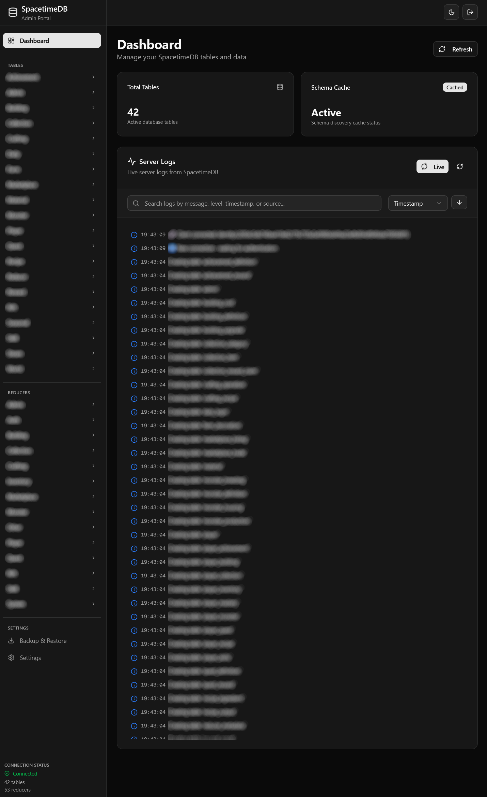
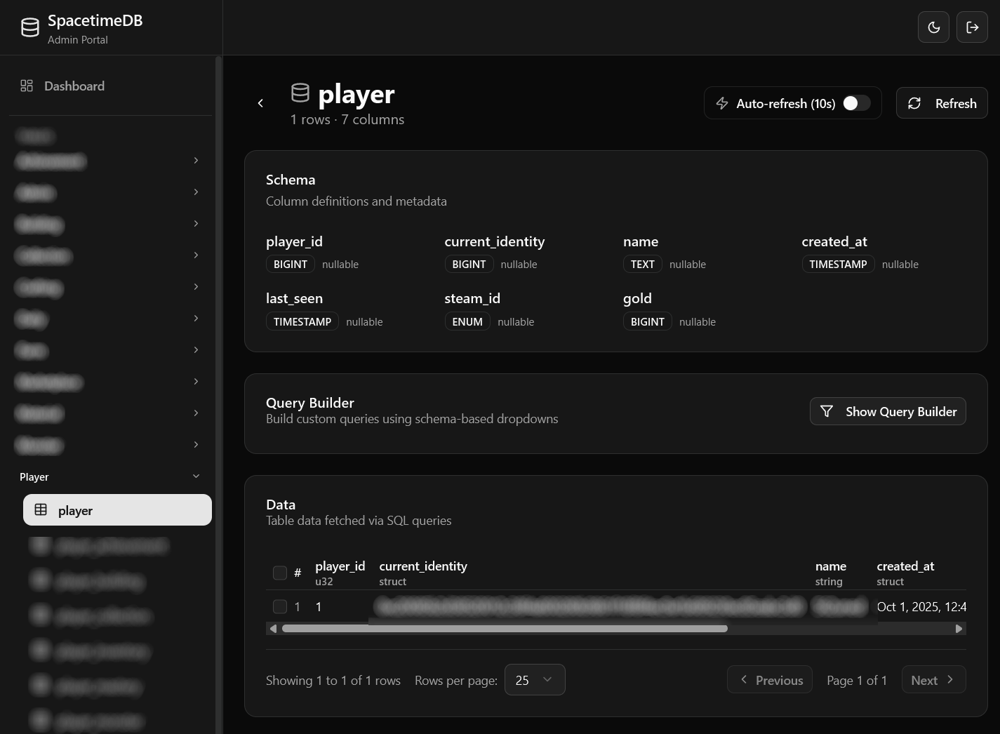
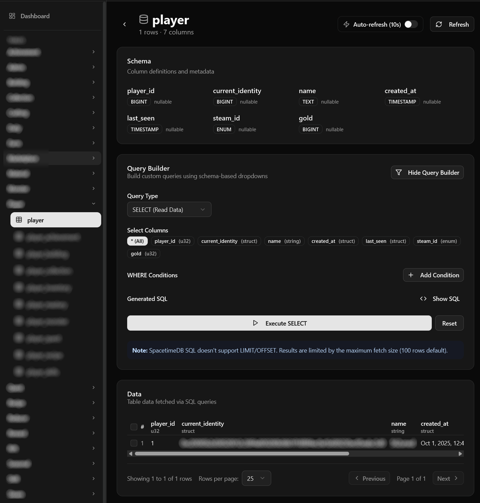
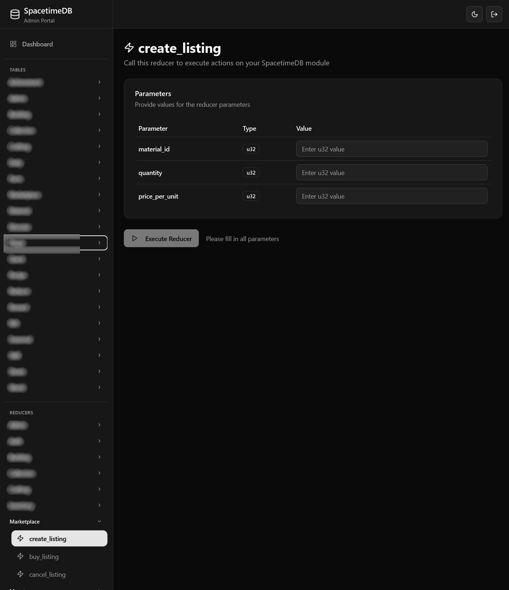

# SpacetimeDB Admin Portal

A professional Next.js admin portal for managing SpacetimeDB instances via HTTP API. Features runtime schema discovery, data viewing, CRUD operations, and comprehensive database management without code generation.

## Quick Start

### 1. Install Dependencies

```bash
npm install
```

### 2. Configure Environment

Create `.env.local`:

```bash
# SpacetimeDB Configuration
NEXT_PUBLIC_SPACETIME_URI=wss://your-spacetime-server.com
NEXT_PUBLIC_SPACETIME_MODULE=your-database-identity
NEXT_PUBLIC_SPACETIME_HTTP_API=https://your-spacetime-server.com/v1/database

# Authentication Token (required for logs and admin endpoints)
# Find your token in: ~/.config/spacetime/cli.toml
# Or run: spacetime identity show
SPACETIME_AUTH_TOKEN=your-auth-token-here

# Keep version as needed
NEXT_PUBLIC_SPACETIME_MODULE_VERSION=9

# Application Configuration
NEXT_PUBLIC_APP_NAME="SpacetimeDB Admin Portal"

# Advanced Configuration
NEXT_PUBLIC_SPACETIME_MAX_RETRIES=3
NEXT_PUBLIC_SPACETIME_RETRY_BACKOFF=2
NEXT_PUBLIC_CACHE_TTL_MINUTES=10
NEXT_PUBLIC_MAX_LIVE_ROWS=10000

# Authentication - CHANGE THESE CREDENTIALS!
# Username and password for admin access
AUTH_USERNAME=admin
AUTH_PASSWORD=change-this-password

# Better Auth Configuration
# Generate a secure random string (minimum 32 characters)
BETTER_AUTH_SECRET=generate-a-secure-random-string-here-min-32-chars
BETTER_AUTH_URL=http://localhost:3000
NEXT_PUBLIC_BETTER_AUTH_URL=http://localhost:3000
```

### 3. Run Development Server

```bash
npm run dev
```

Open [http://localhost:3000](http://localhost:3000)

## Finding Your Auth Token

Your SpacetimeDB authentication token is located in:

```
~/.config/spacetime/cli.toml
```

The token is required for:
- Accessing server logs
- Admin/owner-only operations
- Publishing modules
- Server-side API calls

## Tech Stack

- **Framework**: Next.js 15 (App Router, Turbopack), React 19
- **UI**: shadcn/ui, Tailwind CSS, Radix UI
- **State Management**: Zustand (UI state), TanStack React Query (data fetching & caching)
- **Database**: SpacetimeDB (via HTTP API)
- **Auth**: Better Auth
- **Validation**: Zod
- **TypeScript**: Full type safety

## Backup & Restore (Reducer-Based)

The admin portal includes a fully functional **reducer-based backup system** that correctly handles all SpacetimeDB types (Identity, Timestamp, Arrays).

### Features

✅ **Complete UI** - Create, restore, delete, and manage backups via web interface  
✅ **Safe by Design** - Restore requires typing "DELETE_ALL_DATA" to confirm  
✅ **Audit Logging** - All restore operations are logged  
✅ **Permission Checks** - Admin for backup, Owner for restore  
✅ **Backup History** - View all backups with metadata  

### Quick Start

1. **Navigate to Backup page**: `/backup` in the admin portal
2. **Create a backup**: Enter name and description, click "Create Backup"
3. **Restore if needed**: Click restore, confirm, and your data is rolled back

### Implementation Required

The UI is ready, but you need to implement serialization in your SpacetimeDB Rust module:

```rust
// Implement for each table
fn serialize_player(ctx: &ReducerContext) -> Result<(String, u32), String> {
    let records: Vec<_> = ctx.db.player().iter().collect();
    let data: Vec<_> = records.iter().map(|r| {
        serde_json::json!({
            "identity": format!("{:?}", r.identity),
            "name": r.name,
            // ... all fields
        })
    }).collect();
    Ok((serde_json::to_string(&data)?, records.len() as u32))
}
```

### Documentation

- **[IMPLEMENTATION_SUMMARY.md](docs/IMPLEMENTATION_SUMMARY.md)** - What's done, what you need to do
- **[REDUCER_BASED_BACKUP.md](docs/REDUCER_BASED_BACKUP.md)** - Complete technical guide
- **[RUST_IMPLEMENTATION_GUIDE.md](docs/RUST_IMPLEMENTATION_GUIDE.md)** - Copy-paste patterns
- **[BACKUP_SQL_LIMITATIONS.md](docs/BACKUP_SQL_LIMITATIONS.md)** - Why SQL INSERT fails

### Why Reducers?

| Feature | SQL INSERT | Reducer-Based |
|---------|-----------|---------------|
| Identity columns | ❌ Fails | ✅ Works |
| Timestamp columns | ❌ Fails | ✅ Works |
| Array columns | ❌ Fails | ✅ Works |
| Type safety | ❌ Runtime errors | ✅ Compile-time |

---

<details>
<summary><strong>📖 Complete Setup Guide - Adding Backup to Your SpacetimeDB Module</strong></summary>

<br>

> **For users who cloned this admin portal and want to add backup functionality to their own SpacetimeDB module**

## Overview

This admin portal provides a backup UI out-of-the-box, but you need to add the backend support to **your** SpacetimeDB Rust module. This guide walks you through the complete process.

---

## 🚀 Part 1: Add Backup Tables to Your Module

### 1.1 Create Backup Module Structure

In your SpacetimeDB Rust project:

```bash
cd src
mkdir backup
```

### 1.2 Create `src/backup/mod.rs`

```rust
// Backup and restore module
mod reducers;
mod tables;

pub use reducers::*;
pub use tables::*;
```

### 1.3 Create `src/backup/tables.rs`

```rust
/// Backup metadata - tracks all backups created
#[spacetimedb::table(name = backup_metadata, public)]
#[derive(Debug, Clone)]
pub struct BackupMetadata {
    #[primary_key]
    #[auto_inc]
    pub backup_id: u32,
    pub backup_name: String,
    pub description: String,
    pub created_by_str: String,  // Identity as string
    pub created_at_ms: u64,       // Timestamp as milliseconds
    pub total_tables: u32,
    pub total_records: u32,
    pub is_complete: bool,
}

/// Individual table snapshots within a backup
#[spacetimedb::table(name = backup_table_snapshot, public)]
#[derive(Debug, Clone)]
pub struct BackupTableSnapshot {
    #[primary_key]
    #[auto_inc]
    pub snapshot_id: u32,
    pub backup_id: u32,
    pub table_name: String,
    pub record_count: u32,
    pub data_json: String,  // Serialized table data
    pub created_at_ms: u64,
}

/// Restore operations tracking
#[spacetimedb::table(name = backup_restore_log, public)]
#[derive(Debug, Clone)]
pub struct BackupRestoreLog {
    #[primary_key]
    #[auto_inc]
    pub restore_id: u32,
    pub backup_id: u32,
    pub restored_by_str: String,
    pub started_at_ms: u64,
    pub completed_at_ms: Option<u64>,
    pub tables_restored: u32,
    pub records_restored: u32,
    pub is_successful: bool,
    pub error_message: Option<String>,
}
```

### 1.4 Register Module in `src/lib.rs`

```rust
mod backup;
pub use backup::*;
```

---

## 🔧 Part 2: Implement Backup Reducers

### 2.1 Create `src/backup/reducers.rs` - Helper Functions

```rust
use spacetimedb::{ReducerContext, Table};
use crate::backup::{BackupMetadata, BackupRestoreLog, BackupTableSnapshot};

// Helper to convert Identity to string
fn identity_to_string(identity: &spacetimedb::Identity) -> String {
    format!("{:?}", identity)
}

// Helper to convert Timestamp to milliseconds
fn timestamp_to_ms(timestamp: &spacetimedb::Timestamp) -> u64 {
    let duration = timestamp.to_duration_since_unix_epoch()
        .unwrap_or(std::time::Duration::from_secs(0));
    duration.as_secs() * 1000 + (duration.subsec_millis() as u64)
}

// Helper to escape JSON strings
fn escape_json(s: &str) -> String {
    s.replace('\\', "\\\\")
     .replace('"', "\\\"")
     .replace('\n', "\\n")
     .replace('\r', "\\r")
     .replace('\t', "\\t")
}
```

### 2.2 Add Main Backup Function

```rust
/// Backup all tables in your database
fn backup_all_tables(ctx: &ReducerContext, backup_id: u32) -> Result<(u32, u32), String> {
    let mut total_tables = 0u32;
    let mut total_records = 0u32;
    
    // ⚠️ CUSTOMIZE THIS LIST - Add ALL your table names here
    let table_names = vec![
        "users",
        "posts",
        "comments",
        // Add all your tables here
    ];
    
    // Don't backup the backup tables themselves
    let excluded_tables = vec![
        "backup_metadata",
        "backup_table_snapshot",
        "backup_restore_log"
    ];
    
    for table_name in table_names {
        if excluded_tables.contains(&table_name) {
            continue;
        }
        
        match backup_table_by_name(ctx, backup_id, table_name) {
            Ok(count) => {
                total_records += count;
                total_tables += 1;
                log::info!("📦 Backed up table '{}': {} records", table_name, count);
            }
            Err(e) => {
                log::warn!("⚠️ Failed to backup table '{}': {}", table_name, e);
            }
        }
    }
    
    Ok((total_tables, total_records))
}

/// Backup a single table by name
fn backup_table_by_name(ctx: &ReducerContext, backup_id: u32, table_name: &str) -> Result<u32, String> {
    // ⚠️ CUSTOMIZE THIS - Add cases for YOUR tables
    let data_json = match table_name {
        "users" => serialize_users_table(ctx),
        "posts" => serialize_posts_table(ctx),
        // Add all your tables here
        _ => {
            return Err(format!("Unknown table: {}", table_name));
        }
    };
    
    let record_count = data_json.matches('{').count() as u32;
    
    let snapshot = BackupTableSnapshot {
        snapshot_id: 0,
        backup_id,
        table_name: table_name.to_string(),
        record_count,
        data_json,
        created_at_ms: timestamp_to_ms(&ctx.timestamp),
    };
    
    ctx.db.backup_table_snapshot().try_insert(snapshot)?;
    
    Ok(record_count)
}
```

### 2.3 Add Serialization Functions (Example)

```rust
// ⚠️ Create one function for EACH of your tables
// Example for a "users" table:
fn serialize_users_table(ctx: &ReducerContext) -> String {
    let mut json = String::from("[");
    let mut first = true;
    
    for row in ctx.db.users().iter() {
        if !first { json.push(','); }
        first = false;
        
        // Customize based on YOUR table structure
        json.push_str(&format!(
            r#"{{"id":{},"name":"{}","email":"{}","created_at":{}}}"#,
            row.id,
            escape_json(&row.name),
            escape_json(&row.email),
            timestamp_to_ms(&row.created_at)
        ));
    }
    
    json.push(']');
    json
}

// Repeat for all your tables...
```

### 2.4 Add Reducer Endpoints

```rust
/// Create a full database backup
#[spacetimedb::reducer]
pub fn create_backup(
    ctx: &ReducerContext,
    backup_name: String,
    description: String,
) -> Result<(), String> {
    log::info!("💾 Starting backup: {}", backup_name);
    
    // TODO: Add your admin check here
    // Example: require_admin(ctx)?;
    
    if backup_name.is_empty() || backup_name.len() > 128 {
        return Err("Backup name must be 1-128 characters".to_string());
    }
    
    let backup_metadata = BackupMetadata {
        backup_id: 0,
        backup_name: backup_name.clone(),
        description,
        created_by_str: identity_to_string(&ctx.sender),
        created_at_ms: timestamp_to_ms(&ctx.timestamp),
        total_tables: 0,
        total_records: 0,
        is_complete: false,
    };
    
    let inserted_backup = ctx.db.backup_metadata().try_insert(backup_metadata)?;
    let backup_id = inserted_backup.backup_id;
    
    // Backup all tables
    let (total_tables, total_records) = backup_all_tables(ctx, backup_id)?;
    
    // Mark as complete
    if let Some(mut backup) = ctx.db.backup_metadata().backup_id().find(&backup_id) {
        backup.total_tables = total_tables;
        backup.total_records = total_records;
        backup.is_complete = true;
        ctx.db.backup_metadata().backup_id().update(backup);
    }
    
    log::info!("✅ Backup complete: {} tables, {} records", total_tables, total_records);
    Ok(())
}

/// Delete a backup
#[spacetimedb::reducer]
pub fn delete_backup(ctx: &ReducerContext, backup_id: u32) -> Result<(), String> {
    // TODO: Add admin check
    
    // Delete snapshots
    let snapshots: Vec<_> = ctx.db.backup_table_snapshot()
        .iter()
        .filter(|s| s.backup_id == backup_id)
        .collect();
    
    for snapshot in snapshots {
        ctx.db.backup_table_snapshot().snapshot_id().delete(&snapshot.snapshot_id);
    }
    
    // Delete metadata
    ctx.db.backup_metadata().backup_id().delete(&backup_id);
    
    log::info!("✅ Deleted backup {}", backup_id);
    Ok(())
}

/// Restore from backup (implement with caution!)
#[spacetimedb::reducer]
pub fn restore_backup(
    ctx: &ReducerContext,
    backup_id: u32,
    confirm_deletion: String,
) -> Result<(), String> {
    // TODO: Add OWNER check (highest permission)
    
    if confirm_deletion != "DELETE_ALL_DATA" {
        return Err("Must confirm with 'DELETE_ALL_DATA'".to_string());
    }
    
    // TODO: Implement restore logic
    Err("Restore not implemented yet".to_string())
}
```

---

## 🔐 Part 3: Add Admin Security

### 3.1 Create Admin Table

```rust
#[spacetimedb::table(name = admin, public)]
pub struct Admin {
    #[primary_key]
    pub identity: Identity,
    pub role: String,
    pub granted_at: Timestamp,
}
```

### 3.2 Add Admin Check Function

```rust
fn require_admin(ctx: &ReducerContext) -> Result<(), String> {
    let is_admin = ctx.db.admin()
        .iter()
        .any(|admin| admin.identity == ctx.sender);
    
    if !is_admin {
        return Err("Admin privileges required".to_string());
    }
    
    Ok(())
}
```

### 3.3 Use in Reducers

```rust
#[spacetimedb::reducer]
pub fn create_backup(ctx: &ReducerContext, name: String, desc: String) -> Result<(), String> {
    require_admin(ctx)?;  // ⚠️ Add this line
    // ... rest of function
}
```

---

## 🚢 Part 4: Deploy Your Module

### 4.1 Build

```bash
cd your-spacetimedb-module
cargo build --target wasm32-unknown-unknown --release
```

### 4.2 Publish

```bash
spacetime publish --project-path . your-module-name

# For local testing:
# spacetime publish --project-path . --server local test-module
```

### 4.3 Grant Admin Access

```bash
# Get your identity
spacetime identity list

# Call your grant_admin reducer (you need to implement this):
spacetime call your-module grant_admin '["<your_identity>", "admin"]'
```

---

## ✅ Part 5: Test Backup System

### 5.1 CLI Testing

```bash
# Create a backup
spacetime call your-module create_backup '["test-backup", "Testing deployment"]'

# Verify it was created
spacetime subscribe your-module "SELECT * FROM backup_metadata"

# Check snapshots
spacetime subscribe your-module "SELECT table_name, record_count FROM backup_table_snapshot"

# Delete backup
spacetime call your-module delete_backup '[1]'
```

### 5.2 Portal Testing

1. Open admin portal at `/backup`
2. Click "Create New Backup"
3. Enter name and description
4. Verify backup shows correct table/record counts
5. Test delete functionality

---

## 🔄 Part 6: Adding New Tables (Maintenance)

When you add a new table to your database:

### 6.1 Update Table List

In `backup_all_tables()` function:

```rust
let table_names = vec![
    "users",
    "posts",
    "new_table",  // ⚠️ Add here
];
```

### 6.2 Add Serialization Case

In `backup_table_by_name()` function:

```rust
let data_json = match table_name {
    "users" => serialize_users_table(ctx),
    "new_table" => serialize_new_table(ctx),  // ⚠️ Add here
    _ => { ... }
};
```

### 6.3 Implement Serialization Function

```rust
fn serialize_new_table(ctx: &ReducerContext) -> String {
    let mut json = String::from("[");
    let mut first = true;
    
    for row in ctx.db.new_table().iter() {
        if !first { json.push(','); }
        first = false;
        
        json.push_str(&format!(
            r#"{{"id":{},"field":"{}"}}"#,
            row.id,
            escape_json(&row.field)
        ));
    }
    
    json.push(']');
    json
}
```

### 6.4 Rebuild & Deploy

```bash
cargo build --target wasm32-unknown-unknown --release
spacetime publish --project-path . your-module
```

---

## 📝 Field Type Reference

When serializing fields:

```rust
// Numbers (u32, i32, u64, i64, f32, f64) - no quotes
row.id  // → 123

// Strings - use escape_json() with quotes
escape_json(&row.name)  // → "John\"s Name"

// Booleans - no quotes
row.is_active  // → true

// Optional values - handle None
row.optional.unwrap_or(0)  // For Option<u32>
row.optional.as_deref().unwrap_or("")  // For Option<String>

// Timestamps - use timestamp_to_ms()
timestamp_to_ms(&row.created_at)  // → 1696176000000

// Identity - use identity_to_string()
identity_to_string(&row.owner)  // → "Identity(...)"

// Arrays - escape as JSON string
escape_json(&format!("{:?}", row.tags))
```

---

## 🐛 Troubleshooting

### "Backup tables not found"

**Fix:** Redeploy your module after adding backup tables

```bash
cargo build --target wasm32-unknown-unknown --release
spacetime publish --project-path . your-module
```

### "Not an admin"

**Fix:** Grant yourself admin access

```bash
spacetime identity list
spacetime call your-module grant_admin '["<your_identity>", "admin"]'
```

### "Backup created but shows 0 records"

**Fix:** Implement serialization functions for all your tables (see Part 2.3)

### Dashboard shows old schema

**Fix:** Clear browser cache or force refresh (Ctrl+Shift+R)

---

## 📚 Additional Resources

- **[Full Setup Guide](./BACKUP_RESTORE.md)** - Complete detailed walkthrough
- **[IMPLEMENTATION_SUMMARY.md](docs/IMPLEMENTATION_SUMMARY.md)** - Current implementation status
- **[REDUCER_BASED_BACKUP.md](docs/REDUCER_BASED_BACKUP.md)** - Technical architecture
- **[SpacetimeDB Docs](https://spacetimedb.com/docs)** - Official documentation

---

## ✨ Summary

You've added:
- ✅ Backup tables to your SpacetimeDB module
- ✅ Backup/restore reducers with proper serialization
- ✅ Admin security checks
- ✅ Integration with the admin portal

The portal UI is ready - just implement serialization for your specific tables and deploy!

</details>

## Organizing Reducers with Metadata

To make your reducers more discoverable and better organized in admin tools, implement a metadata table. This allows you to categorize, document, and control access to reducers.

### 1. Define the Metadata Table

Add this to your SpacetimeDB module:

```rust
use spacetimedb::Timestamp;

/// Reducer metadata for frontend categorization and documentation
#[spacetimedb::table(name = reducer_metadata, public)]
#[derive(Debug, Clone)]
pub struct ReducerMetadata {
    #[primary_key]
    pub reducer_name: String,
    pub category: String,        // "admin", "player", "marketplace", etc.
    pub subcategory: String,     // "management", "actions", "query", etc.
    pub required_role: String,   // "any", "authenticated", "admin", "owner"
    pub description: String,
    pub is_deprecated: bool,
    pub tags: String,            // Comma-separated: "economy,trading,public"
    pub sort_order: u32,         // For custom sorting
    pub created_at: Timestamp,
}
```

### 2. Initialize Metadata in Your Init Reducer

```rust
pub fn initialize_reducer_metadata(ctx: &spacetimedb::ReducerContext) -> Result<(), String> {
    use spacetimedb::Table;
    
    let metadata = vec![
        // System reducers
        ReducerMetadata {
            reducer_name: "init".to_string(),
            category: "system".to_string(),
            subcategory: "lifecycle".to_string(),
            required_role: "any".to_string(),
            description: "Initialize database (first call becomes owner)".to_string(),
            is_deprecated: false,
            tags: "system,lifecycle,admin".to_string(),
            sort_order: 1,
            created_at: ctx.timestamp,
        },
        
        // Player actions
        ReducerMetadata {
            reducer_name: "update_player_name".to_string(),
            category: "player".to_string(),
            subcategory: "profile".to_string(),
            required_role: "authenticated".to_string(),
            description: "Update player display name".to_string(),
            is_deprecated: false,
            tags: "player,profile,settings".to_string(),
            sort_order: 200,
            created_at: ctx.timestamp,
        },
        
        // Admin operations
        ReducerMetadata {
            reducer_name: "grant_admin".to_string(),
            category: "admin".to_string(),
            subcategory: "roles".to_string(),
            required_role: "owner".to_string(),
            description: "Grant admin role to a player".to_string(),
            is_deprecated: false,
            tags: "admin,security,roles".to_string(),
            sort_order: 100,
            created_at: ctx.timestamp,
        },
    ];
    
    // Insert all metadata
    for meta in metadata {
        ctx.db.reducer_metadata().try_insert(meta)?;
    }
    
    log::info!("✅ Reducer metadata initialized");
    Ok(())
}
```

### 3. Call During Initialization

```rust
#[spacetimedb::reducer(init)]
pub fn init(ctx: &ReducerContext) -> Result<(), String> {
    // Your other init logic...
    
    // Initialize reducer metadata
    initialize_reducer_metadata(ctx)?;
    
    Ok(())
}
```

### Benefits

- **Auto-documentation**: Frontend can display reducers with descriptions and categories
- **Role-based filtering**: Hide admin-only reducers from regular users if setup
- **Better organization**: Group related reducers together
- **Deprecation tracking**: Mark old reducers as deprecated
- **Search & discovery**: Tags make reducers searchable
- **Custom sorting**: Control display order

## Project Structure

```
spacetime-admin-portal/
├── app/
│   ├── (dashboard)/           # Dashboard routes
│   │   ├── page.tsx          # Dashboard home
│   │   ├── tables/[name]/    # Table view
│   │   ├── backup/           # Backup & restore
│   │   └── settings/         # Settings
│   ├── api/                  # API routes
│   │   ├── schema/           # Schema discovery
│   │   └── sql/              # Query & mutation endpoints
│   ├── layout.tsx            # Root layout
│   └── providers.tsx         # Client providers
├── components/
│   ├── ui/                   # shadcn components
│   └── layout/               # Layout components
├── lib/
│   ├── spacetime/            # SpacetimeDB clients
│   │   ├── http-client.ts   # HTTP API client
│   │   ├── sdk-client.ts    # WebSocket SDK wrapper
│   │   └── schema-discovery.ts
│   ├── config.ts             # App configuration
│   └── utils.ts              # Utility functions
├── hooks/
│   ├── use-tables.ts         # Table listing hooks
│   └── use-table-data.ts     # Table data hooks
└── types/
    ├── spacetime.ts          # SpacetimeDB types
    ├── schema.ts             # Schema types
    └── api.ts                # API types
```

## Architecture

### HTTP API Based

- **Server-Side**: SpacetimeDB HTTP API for all operations (queries, mutations, schema discovery)
- **Client-Side**: TanStack React Query for efficient data fetching, caching, and state management
- **Schema**: Runtime discovery via HTTP API (no code generation or bindings needed)
- **No WebSocket**: Currently using HTTP polling; real-time subscriptions can be added later if needed

### Key Features

✅ **Runtime schema discovery** - No code generation required  
✅ **Smart caching** - TanStack Query with 5-minute stale time + exponential backoff retries  
✅ **Type-safe** - Full TypeScript + Zod validation  
✅ **Professional UI** - shadcn/ui components with dark mode  
✅ **Efficient polling** - Configurable cache TTL prevents expensive API overages  
✅ **Error handling** - Comprehensive error boundaries and user feedback  
✅ **Optimized** - Retry limits, smart caching, pagination to minimize costs  

## API Endpoints

### Schema Discovery

- `GET /api/schema/tables` - List all tables
- `POST /api/schema/tables` - Refresh schema cache
- `GET /api/schema/table/[name]` - Get table schema

### Data Operations

- `POST /api/sql/query` - Execute SELECT with pagination
- `POST /api/sql/mutate` - Execute INSERT/UPDATE/DELETE
- `POST /api/sql/bulk` - Bulk operations

## Configuration

### Environment Variables

| Variable | Description | Default |
|----------|-------------|---------|
| `NEXT_PUBLIC_SPACETIME_URI` | WebSocket URI | `wss://your-server.com` |
| `NEXT_PUBLIC_SPACETIME_MODULE` | Database identity | (required) |
| `NEXT_PUBLIC_SPACETIME_HTTP_API` | HTTP API URL | `https://your-server.com/v1/database` |
| `SPACETIME_AUTH_TOKEN` | Auth token for admin ops | (required, see `~/.config/spacetime/cli.toml`) |
| `NEXT_PUBLIC_SPACETIME_MODULE_VERSION` | Module version | `9` |
| `NEXT_PUBLIC_SPACETIME_MAX_RETRIES` | Max retry attempts | `3` |
| `NEXT_PUBLIC_SPACETIME_RETRY_BACKOFF` | Retry backoff multiplier | `2` |
| `NEXT_PUBLIC_CACHE_TTL_MINUTES` | Schema cache TTL | `10` |
| `NEXT_PUBLIC_MAX_LIVE_ROWS` | Subscription row limit | `10000` |
| `AUTH_USERNAME` | Admin username | `admin` |
| `AUTH_PASSWORD` | Admin password | **CHANGE THIS!** |
| `BETTER_AUTH_SECRET` | Better Auth secret (32+ chars) | (required) |
| `BETTER_AUTH_URL` | Better Auth URL | `http://localhost:3000` |
| `NEXT_PUBLIC_BETTER_AUTH_URL` | Better Auth public URL | `http://localhost:3000` |

### Performance Settings

- **Schema Caching**: 10-minute TTL (configurable) - reduces API calls
- **Query Caching**: 5-minute stale time with TanStack React Query
- **Retry Policy**: Max 3 retries with exponential backoff (1s, 2s, 4s...)
- **Max Live Rows**: 10,000 row limit to prevent expensive operations
- **Request Deduplication**: TanStack Query automatically deduplicates identical requests

## Development

### Build for Production

```bash
npm run build
npm start
```


## Best Practices

### Efficiency & Cost Optimization

This app is optimized for minimal API usage on Supabase, Vercel, and other metered platforms:

- **Smart Caching**: TanStack Query caches data for 5 minutes (stale time) - reduces redundant API calls
- **Retry Limits**: Max 3 retries with exponential backoff - prevents infinite retry loops
- **Request Deduplication**: Multiple components requesting same data only triggers one API call
- **Row Limits**: 10,000 max rows to prevent fetching massive datasets
- **Schema Caching**: 10-minute TTL on schema discovery - schema rarely changes
- **HTTP API Only**: Simple fetch-based architecture
- **Batch Operations**: Use bulk endpoints when available
- **Conditional Fetching**: Queries disabled until required data is available (`enabled` flag)

## Screenshots

Below are a few screenshots of the SpacetimeDB Admin Portal:









### Security

- Keep `SPACETIME_AUTH_TOKEN` in `.env.local` (never commit)
- Use environment variables for all configuration
- Implement proper role-based access control
- Validate all inputs with Zod

## License

MIT

---

Built with ❤️ for SpacetimeDB
